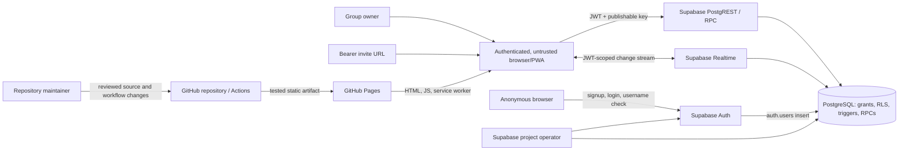

# BeerMe threat model

Status: Canonical repository threat model  
Security owner: Repository owner (`christopherrbrown3`)  
Last reviewed: 2026-07-18  
Next scheduled review: 2026-10-18

## Overview

BeerMe is a multi-user social IOU ledger. It records informal obligations inside invite-only
groups; it does not move money, value assets, or collect real email addresses. The deployed v0.1
product is a static React progressive web application hosted on GitHub Pages. Each browser talks
directly to Supabase Auth, PostgREST, PostgreSQL, and Realtime with a publishable key. There is no
trusted application server between an untrusted client and the database.

The ledger and its authorization rules are the highest-value runtime surfaces. PostgreSQL Row
Level Security (RLS), grants, constraints, triggers, and authenticated security-definer functions
must remain authoritative because all browser code, browser storage, route parameters, and API
requests can be modified by an attacker.

Notifications and native iOS/Android wrappers are roadmap surfaces, not deployed repository
features. Before either ships, this model must be updated with their concrete data flows, secret
storage, delivery providers, device identifiers, signing systems, deep-link handling, and store
release boundaries.

### Assets and security objectives

| Asset or privilege                                          | Security objective                                                                                                   |
| ----------------------------------------------------------- | -------------------------------------------------------------------------------------------------------------------- |
| Supabase sessions, refresh tokens, and password credentials | Prevent theft, fixation, unintended identity changes, disclosure, and cross-user reuse.                              |
| Username-to-auth-identity mapping                           | Keep usernames unique and immutable; never authorize with display names or client-supplied user IDs.                 |
| Profiles                                                    | Reveal identity fields only to the user, current group peers, or peers needed to understand retained ledger history. |
| Group membership and owner role                             | Maintain tenant isolation, exactly one effective owner, and database-enforced lifecycle changes.                     |
| Invite tokens                                               | Treat as bearer capabilities: unguessable, minimally exposed, revocable, and never logged or sent to QR vendors.     |
| Transaction history and notes                               | Preserve confidentiality within authorized groups and append-only integrity except explicit whole-group deletion.    |
| Reversal attribution                                        | Permit one complete reversal by an authorized creator or owner without rewriting the original IOU.                   |
| Availability and bounded resource use                       | Keep normal pages, joins, authentication, writes, exports, and future notifications resistant to abuse.              |
| Publishable configuration                                   | Permit browser exposure only of the Supabase URL and publishable key; never expose service-role or signing secrets.  |
| Build and deployment integrity                              | Prevent unreviewed code, compromised dependencies, or leaked CI credentials from changing the deployed PWA.          |
| Future notification and native secrets                      | Keep Web Push/APNs/FCM credentials, native signing keys, and provider tokens outside client bundles and logs.        |

## Threat Model, Trust Boundaries, and Assumptions

### Actors and capabilities

- An anonymous remote attacker can load and modify the public application, inspect its bundle,
  call public Supabase endpoints, attempt signup and login, test usernames, and present arbitrary
  URLs and invite-token guesses.
- A malicious authenticated user has a valid session and can bypass the UI, issue arbitrary
  PostgREST/RPC requests, replay requests, edit IDs and payloads, open concurrent sessions, and
  create high request volume. They may be a current member, former member, group owner, or member
  of several unrelated groups.
- A bearer-invite holder can share or leak the invite URL. Possession proves access to the token,
  not informed intent to join or a real-world relationship with the owner.
- A compromised browser, extension, device, or same-origin script can act with the current
  session. Client-side controls cannot defend the user after that compromise; server-side tenant
  isolation and ledger invariants must still limit impact to the compromised identity.
- Repository maintainers and Supabase project operators are privileged. A compromised maintainer,
  GitHub token, workflow dependency, Supabase dashboard account, or service-role key can affect all
  tenants and deployment integrity.
- Future push providers and app stores will be partially trusted processors. They must receive the
  minimum metadata needed for delivery and must not become authorization sources.

### Trust boundaries

| Boundary                                            | Untrusted or less-trusted side                                           | Trusted control and required invariant                                                                                                              |
| --------------------------------------------------- | ------------------------------------------------------------------------ | --------------------------------------------------------------------------------------------------------------------------------------------------- |
| Browser to Supabase Auth                            | Username/password forms, stored session, URL state                       | Supabase Auth verifies credentials and rate limits attempts. A session changes only through an intentional auth flow.                               |
| Browser to PostgREST/RPC                            | Every table name, filter, UUID, quantity, note, token, and claimed actor | PostgreSQL grants, RLS, constraints, triggers, and RPC checks derive identity from `auth.uid()` and reject unauthorized operations.                 |
| Group to unrelated group                            | Authenticated user-controlled IDs and joins                              | RLS returns only current memberships, groups, transactions, and legitimately relevant historical profiles. Knowing a UUID does not confer access.   |
| Member to group owner                               | Modified UI and direct owner-operation calls                             | Owner status is read and locked in PostgreSQL for every privileged or destructive action.                                                           |
| Invite URL to membership                            | Leaked, replayed, malformed, or guessed bearer token                     | Token validation is scoped, error output is minimal, joining requires explicit confirmation, and owners can rotate compromised tokens.              |
| PostgreSQL to Realtime client                       | Subscriptions and invalidation storms                                    | Realtime applies row visibility, never broadens RLS access, and clients refetch authoritative bounded queries after lifecycle changes.              |
| Auth metadata trigger to profile                    | Attacker-supplied signup metadata                                        | `handle_new_user` validates and normalizes the immutable username and display name before profile creation.                                         |
| Source repository to deployed Pages artifact        | Contributions, dependencies, Actions, build variables                    | Protected review and CI produce a reproducible artifact; only publishable configuration is embedded. Deployment credentials are least-privileged.   |
| PWA/service worker to browser cache                 | Previously trusted but stale JavaScript                                  | Updates must not strand clients on insecure code; logout and identity change clear user-scoped cached data.                                         |
| Future server-side notification worker to providers | User content, device endpoints, event retries                            | The worker re-authorizes membership at send time, minimizes lock-screen content, rate limits, deduplicates, and keeps provider secrets server-side. |
| Future native shell to shared web runtime           | Deep links, platform intents, WebView bridge, local token store          | Allowlisted routes and bridge methods, platform-protected credential storage, shared RLS APIs, and verified app/site links.                         |

### Security invariants

1. The publishable key is public and grants no authority by itself. No service-role, database,
   notification-provider, or native-signing secret may enter `VITE_*`, the repository, logs, or a
   browser/native web bundle.
2. `auth.uid()` is the only source of the current database identity. User IDs, `created_by`, roles,
   display names, usernames, and group IDs supplied by a client are claims to validate, not proof.
3. A user can read a group, membership, or transaction only while current RLS policy authorizes it.
   Former-member profile access is limited to identity needed to interpret retained history.
4. Only group members may create IOUs, and debtor, creditor, and creator must be current members of
   that same group. Quantity, note, and party constraints apply even when the UI is bypassed.
5. Ledger rows are immutable. A reversal is complete, attributable, authorized, and occurs at most
   once. Only an explicit owner-authorized whole-group deletion may remove history.
6. Every privileged or destructive group action authenticates and authorizes in a trusted database
   function or policy, locks mutable authorization state where races matter, and exposes no secret
   fields unnecessarily.
7. A group always has one effective owner. Ownership, owner membership role, and owner lifecycle
   cannot diverge or leave an ownerless group.
8. Invite possession does not silently mutate membership. Joining, retrying, rotation, leaving,
   and deletion require explicit user actions, while invite errors do not disclose unrelated group
   data.
9. Cache keys and invalidation respect identity boundaries. Signing out or changing identity makes
   previous-user profile, group, ledger, and activity data inaccessible in memory and UI.
10. Routine reads and writes are bounded independently of lifetime ledger size. Realtime events
    coalesce invalidation rather than amplify exhaustive refetches.
11. User-controlled text is rendered as text, constrained at both client and database boundaries,
    and excluded from operational telemetry unless safely redacted.

### Input ownership

- **Attacker-controlled:** route and query parameters; invite tokens and URLs; auth form fields;
  signup metadata; all UUIDs and filters in API calls; display names, group names/descriptions,
  unit labels/symbols, quantities, and transaction notes; request ordering, concurrency, replay,
  cancellation, and volume; Realtime subscription attempts; deep links and notification payloads
  once those features exist.
- **Operator-controlled:** Supabase project/Auth/Realtime configuration, database migrations and
  grants, GitHub Pages settings, repository protections, Actions variables, DNS/custom-domain
  configuration, incident response, backups, and future notification-provider credentials.
- **Developer-controlled:** application source, dependencies and lockfile, migrations, workflows,
  tests, PWA manifest/service worker policy, generated types, and future native wrapper/bridge code.

### Assumptions and explicit non-goals

- Supabase correctly verifies JWTs and enforces PostgreSQL RLS according to the deployed migration
  state. GitHub and Supabase platform compromise is possible but outside application-code control;
  least privilege, MFA, audit logs, dependency pinning, backups, and response procedures reduce it.
- HTTPS, the custom domain, and platform TLS terminate correctly. Network attackers are not assumed
  able to break TLS.
- The application cannot make a fully compromised endpoint trustworthy. It can prevent that
  endpoint from crossing database tenant boundaries or corrupting immutable history beyond the
  permissions of its authenticated user.
- Informal IOUs have social sensitivity but are not payments or regulated financial balances.
  Authentication data and potentially sensitive free-text notes still require strong protection.
- Denial of service against GitHub Pages or Supabase infrastructure itself is handled primarily by
  those providers. Application-level amplification, unbounded queries, and domain write abuse are
  in scope.
- Email delivery, password reset, OAuth, push delivery, and native wrappers are not current product
  capabilities. Any introduction is a review trigger, not an assumption that this model already
  approves their design.

## Attack Surface, Mitigations, and Attacker Stories

### Current controls and required verification

| Surface                     | Existing control grounded in the repository                                                                                    | Important attacker story / required test                                                                                                                                                                                                       | Tracked gap                                                                                                                                                                                                                                                                                                               |
| --------------------------- | ------------------------------------------------------------------------------------------------------------------------------ | ---------------------------------------------------------------------------------------------------------------------------------------------------------------------------------------------------------------------------------------------- | ------------------------------------------------------------------------------------------------------------------------------------------------------------------------------------------------------------------------------------------------------------------------------------------------------------------------- |
| Username/password auth      | `.invalid` internal identifiers in `authService.ts`; Supabase password auth; normalized usernames; generic login failure copy  | Anonymous users enumerate usernames, automate signup/login, reuse passwords, or cause a session to change through URL state. Test signup, login, refresh, logout, identity cache clearing, and URL-derived session rejection.                  | [#46](https://github.com/christopherrbrown3/beerme/issues/46), [#69](https://github.com/christopherrbrown3/beerme/issues/69)                                                                                                                                                                                              |
| Profile creation/update     | `handle_new_user`, table constraints, update-column grant, and self-update RLS                                                 | A user injects invalid identity metadata, updates another profile, or reads a stranger profile by UUID. Test owner/member/former-member/stranger/anonymous visibility.                                                                         | [#45](https://github.com/christopherrbrown3/beerme/issues/45), [#68](https://github.com/christopherrbrown3/beerme/issues/68)                                                                                                                                                                                              |
| Group creation and settings | Insert/update grants plus owner RLS; owner membership trigger; bounded field constraints                                       | A client claims another owner, changes an unrelated group, or races ownership/lifecycle actions. Test direct PostgREST paths as every actor.                                                                                                   | [#38](https://github.com/christopherrbrown3/beerme/issues/38), [#45](https://github.com/christopherrbrown3/beerme/issues/45)                                                                                                                                                                                              |
| Invite join                 | Random UUID capability and authenticated `join_group` RPC with pinned `search_path`                                            | An invite is guessed, leaked, replayed, rendered under the wrong account, or auto-accepted. Test invalid-token indistinguishability, explicit confirmation, one mutation per click, rotation, and throttling.                                  | [#40](https://github.com/christopherrbrown3/beerme/issues/40), [#46](https://github.com/christopherrbrown3/beerme/issues/46), [#70](https://github.com/christopherrbrown3/beerme/issues/70)                                                                                                                               |
| Membership lifecycle        | RLS visibility; authenticated `leave_group` and `delete_group`; row locks; owner checks                                        | A former member retains reads/Realtime access, an owner leaves a group ownerless, or a stranger invokes lifecycle RPCs. Test prompt revocation, races, and historical-profile exception.                                                       | [#38](https://github.com/christopherrbrown3/beerme/issues/38), [#39](https://github.com/christopherrbrown3/beerme/issues/39), [#45](https://github.com/christopherrbrown3/beerme/issues/45)                                                                                                                               |
| Ledger reads/writes         | Transaction RLS, insert column grants, membership checks for all parties, database constraints                                 | A member writes for a stranger, supplies another creator, reads another group, injects oversized content, or floods writes. Test UI bypass, concurrent removal, and bounded request cost.                                                      | [#45](https://github.com/christopherrbrown3/beerme/issues/45), [#46](https://github.com/christopherrbrown3/beerme/issues/46), [#71](https://github.com/christopherrbrown3/beerme/issues/71), [#72](https://github.com/christopherrbrown3/beerme/issues/72), [#73](https://github.com/christopherrbrown3/beerme/issues/73) |
| Reversal and deletion       | `protect_transaction_history`; `reverse_transaction`; owner-only `delete_group`; row locks and local deletion guard            | A caller edits or deletes history, reverses twice, reverses without authority, or abuses the group-deletion guard. Test direct DML/RPC, rollback, concurrency, and cross-group IDs.                                                            | [#45](https://github.com/christopherrbrown3/beerme/issues/45)                                                                                                                                                                                                                                                             |
| Realtime and client cache   | RLS-scoped publications and TanStack Query invalidations                                                                       | Removed or signed-out users retain stale data; a burst of changes amplifies unbounded refetches; delete events fail to evict. Test two sessions, focus refetch, identity transitions, and event bursts.                                        | [#39](https://github.com/christopherrbrown3/beerme/issues/39), [#71](https://github.com/christopherrbrown3/beerme/issues/71), [#72](https://github.com/christopherrbrown3/beerme/issues/72)                                                                                                                               |
| PWA, routes, and rendering  | React text escaping; UUID checks; same-origin Pages fallback; Workbox-generated service worker                                 | Crafted links trigger mutations, malicious text becomes script, stale service workers retain vulnerable code, or cached data crosses identities. Test deep links, CSP/deployment headers where available, update/logout, and offline behavior. | [#65](https://github.com/christopherrbrown3/beerme/issues/65), [#69](https://github.com/christopherrbrown3/beerme/issues/69), [#70](https://github.com/christopherrbrown3/beerme/issues/70)                                                                                                                               |
| CI/CD and dependencies      | Read-only default workflow permission; locked npm install; quality and e2e gates; Pages OIDC only in deploy job                | A dependency/action is compromised, a pull request exfiltrates variables, or an unreviewed artifact deploys. Test/inspect permissions, pinning, secret scanning, provenance, branch protection, and rollback.                                  | [#47](https://github.com/christopherrbrown3/beerme/issues/47), [#48](https://github.com/christopherrbrown3/beerme/issues/48)                                                                                                                                                                                              |
| Future notifications        | No deployed implementation; roadmap requires preferences, outbox, send-time authorization, retries, and privacy-safe telemetry | A removed member receives content, endpoints leak, retries duplicate alerts, lock screens expose notes, or providers become a data store. Threat-model and test before first provider integration.                                             | [#50](https://github.com/christopherrbrown3/beerme/issues/50)–[#55](https://github.com/christopherrbrown3/beerme/issues/55)                                                                                                                                                                                               |
| Future native wrappers      | No deployed implementation; roadmap requires a shared RLS-enforced backend                                                     | Malicious deep links invoke privileged bridge methods, tokens are stored insecurely, a WebView navigates off-origin, or signing/release credentials leak. Threat-model and test before the architecture decision ships.                        | [#56](https://github.com/christopherrbrown3/beerme/issues/56)–[#61](https://github.com/christopherrbrown3/beerme/issues/61)                                                                                                                                                                                               |

### Repository-context threat classes

- **Spoofing and session integrity:** stolen credentials or refresh tokens, unintended URL session
  adoption, username enumeration, and unsafe future deep links can cause actions under the wrong
  identity. Server authorization limits cross-tenant impact but does not make misattributed new
  ledger entries harmless.
- **Tampering:** modified clients can call every granted operation. Missing RLS checks, overly broad
  grants, mutable ledger columns, unsafe security-definer functions, or races in ownership and
  reversal are primary integrity threats.
- **Repudiation:** mutable history or missing `created_by`/`reversed_by` attribution would undermine
  the product. Append-only entries and attributable one-time reversal are core controls. Operational
  logs must avoid secrets and note content while retaining enough redacted evidence for response.
- **Information disclosure:** tenant-crossing queries, broad profile visibility, leaked invite
  tokens, service-role keys in frontend variables, transaction notes in telemetry/notifications,
  or stale cross-user cache data are material. UUIDs and publishable keys are not secrets.
- **Denial of service:** unbounded all-history reads, Realtime invalidation amplification, auth and
  invite guessing, transaction bursts, and future notification retries can exhaust browser or
  Supabase resources. Provider-level volumetric denial of service is lower-control but
  application-created amplification is in scope.
- **Elevation of privilege:** trusting `owner_id`, `created_by`, membership role, or target user IDs
  from the client; permissive function execution; unpinned function resolution; service-role key
  exposure; and unsafe future native bridges could elevate a member or anonymous user.
- **Supply-chain compromise:** npm packages, GitHub Actions, build variables, maintainer accounts,
  service workers, and future native dependencies/signing infrastructure can affect every user.

### Temporary accepted risks

These are time-bounded product decisions, not claims that the behavior is safe. The security owner
must close, re-accept, or re-severity each item by its review date.

| Risk                                                                                        | Rationale and compensating controls                                                                                                                                                                          | Owner            | Review date |
| ------------------------------------------------------------------------------------------- | ------------------------------------------------------------------------------------------------------------------------------------------------------------------------------------------------------------ | ---------------- | ----------- |
| Username availability can reveal whether a normalized username exists.                      | The product uses usernames as public handles and returns no profile or credential data. Automated enumeration and auth throttling remain required under #46.                                                 | Repository owner | 2026-08-18  |
| Invite UUIDs are long-lived bearer capabilities until rotation ships.                       | Tokens are generated in PostgreSQL, require authentication to redeem, are visible only to current members under present group RLS, and QR generation stays on-device. Rotation/revocation is tracked in #40. | Repository owner | 2026-08-18  |
| A valid authenticated invite route currently joins on render.                               | Scope is one user and one invited group; the user can leave, and RLS still protects other groups. Explicit preview and confirmation is tracked in #70.                                                       | Repository owner | 2026-08-18  |
| Browser startup currently allows Supabase URL-session detection despite password-only auth. | RLS continues to isolate the active identity, but new records could be entered under an unintended account. Disabling URL adoption and locking it with a test is tracked in #69.                             | Repository owner | 2026-08-18  |
| Dashboard, Activity, and group-ledger reads scale with lifetime accessible history.         | Tenant isolation remains enforced and exploitation requires authorized/shared history. Server-side summaries, bounded feeds, and pagination are tracked in #71–#73.                                          | Repository owner | 2026-09-18  |

### Review triggers and maintenance

The repository owner reviews this document at least quarterly and in the same pull request when a
change does any of the following:

- adds or changes a public table, grant, RLS policy, trigger, security-definer function, Realtime
  publication, authentication method, session behavior, or authorization role;
- changes invite semantics, ownership, member removal, ledger mutability, exports, account
  recovery, data retention, deletion, or backup/restore behavior;
- introduces an Edge Function, application server, analytics/error vendor, notification provider,
  device subscription, native shell/bridge, deep link, new origin, or third-party processor;
- stores a new secret or personal-data class, adds CI credentials/workflow permissions, changes the
  deployment path, or responds to a supply-chain/security incident;
- validates a security finding at Critical or High, changes a risk acceptance, or finds that a
  documented invariant or assumption is false.

Every review updates the dates above, checks links and deployed behavior, records newly accepted
risks with an owner and deadline, and creates a separate issue for any mitigation that cannot land
with the triggering change. Issue [#43](https://github.com/christopherrbrown3/beerme/issues/43)
tracks establishment and ongoing ownership of this model; [#45](https://github.com/christopherrbrown3/beerme/issues/45)
is the adversarial database-control audit that consumes it.

## Severity Calibration (Critical, High, Medium, Low)

Severity considers cross-tenant reach, required privileges, confidentiality/integrity impact,
recoverability, scale, and the social rather than financial nature of BeerMe's ledger.

### Critical

- Remote exposure of a Supabase service-role/database credential, native signing key, or future
  notification-provider credential that enables broad privileged access.
- An unauthenticated, low-complexity path to read or irreversibly alter most groups' private ledger
  data, or compromise the deployed build for substantially all users.
- A tenant-isolation failure with broad automated impact and no meaningful user interaction.

### High

- A malicious member or anonymous attacker can read or tamper with another group's transactions or
  notes, become owner, delete another group, or bypass membership checks in a privileged RPC.
- Stored script execution or a supply-chain compromise reliably steals active sessions across many
  users.
- Ledger immutability or reversal authorization can be bypassed with durable, difficult-to-repair
  impact. Scope limited to one unrelated group may remain High because group trust is the core
  security promise.

### Medium

- A leaked valid invite, session-integrity flaw, or lifecycle race causes unauthorized membership
  or actions within one known group but does not grant ownership or cross-group access.
- Sensitive notes or profile data leak for a limited number of users through cache, Realtime, URL,
  telemetry, or notification handling.
- Authenticated write/resource abuse materially affects a group or project availability without a
  provider-wide outage.

### Low

- Same-group performance degradation requires substantial accepted history and does not expose
  another tenant.
- Limited username/account-existence disclosure where usernames are intended public identifiers
  and no credentials or private profile fields are revealed.
- Client-only validation, UI authorization, or error-detail flaws are Low only when database
  controls demonstrably preserve every confidentiality and integrity invariant; otherwise severity
  follows the reachable server-side impact.
- Cosmetic spoofing, stale non-sensitive labels, or availability defects with a simple recovery and
  no durable ledger impact are Low.

Documentation-only mistakes are not automatically Low: an incorrect migration, secret-handling
instruction, or deployment procedure inherits the severity of the realistic runtime outcome it can
cause.

Repository: target_sha256_55c32883b9621e165bb86a97eb77d6ff770e3280b76f12ad2df1f07473cf2ab9
Version: b87a88d3c9bd708f1c259e4d74bacceeea9088c5
